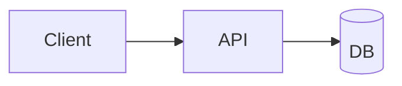

# 🗺️ 계획: <주제>

## 목표
이 계획이 끝났을 때의 상태를 한 문단으로.

## 구조


## 변경 대상
| 경로 | 신규/수정 | 역할 |
|---|---|---|
| | | |

## Task 목록

### Task 1 — <제목>
- **목적**: 
- **선행**: 없음
- **먼저 쓸 테스트**: 
- **DoD**: 빌드 통과 / 테스트 통과 / 
- **검증**: `<실제 명령>`
- **예상 규모**: ~N줄

### Task 2 — <제목>
- **목적**: 
- **선행**: Task 1
- **먼저 쓸 테스트**: 
- **DoD**: 
- **검증**: 

## 의존 그래프
```
Task 1 → Task 2 → Task 4
      ↘ Task 3 ↗
```

## PoC 로 먼저 확인할 것 (가장 앞 Task 로)
- [ ] 

## 롤백
방향이 틀렸다고 판단되면 어떻게 되돌리나.

## 관련
- 분석: [[]]
