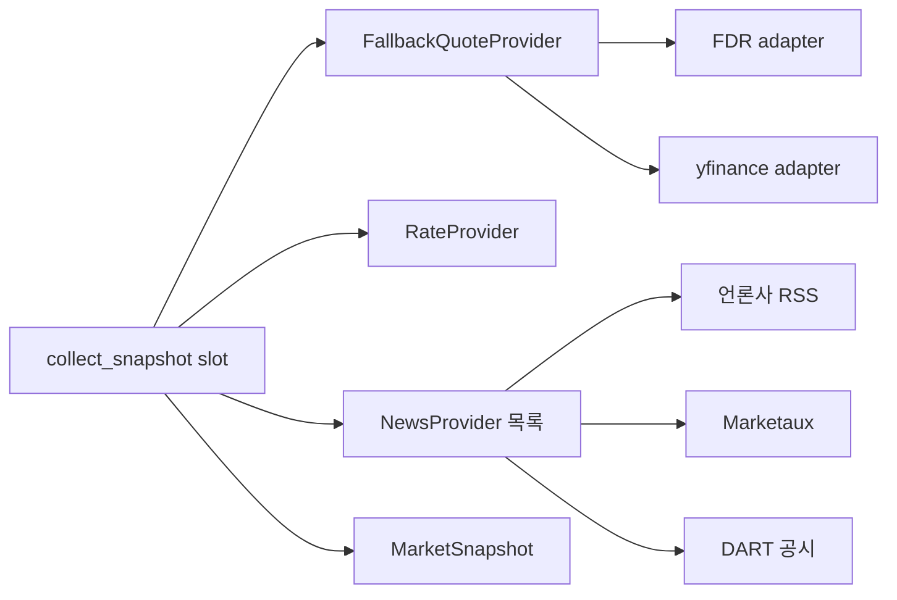

# 🗺️ 계획: 데이터 출처 (시세·뉴스 수집)

## 목표
발송 슬롯(국내 개장 / 미국 개장)을 넘기면 그 시점에 필요한 시세(지수·환율·금리의 종가와 등락률)와
뉴스(제목·요약·링크)를 모아 `MarketSnapshot` 하나로 돌려주는 수집 계층이 `src/finbrief_analyzer/collect/` 에 있다.
출처는 전부 인터페이스 뒤에 있어 어댑터 하나만 바꾸면 교체된다.
출처 하나가 실패해도 예외로 죽지 않고 해당 항목을 "누락"으로 표시한 스냅샷을 돌려준다.

**이 계획의 범위 밖**: LLM 요약(브리핑 작성)과 발송. 발송은 [[2026-10-07_delivery-channels]] 에서 다루고,
LLM 요약은 분석이 아직 없어 별도 리서치·분석이 필요하다.

## 구조


## 설계 결정
- **동기 인터페이스**: FinanceDataReader·yfinance 가 동기(pandas) 라이브러리이고, 수집은 하루 2회 도는 배치다. `Protocol` 은 동기 메서드로 두고 HTTP 는 `httpx.Client` 를 쓴다.
- **외부 호출은 주입한다**: 어댑터는 "가져오는 함수" 또는 `httpx.Client` 를 생성자에서 받는다. 테스트는 네트워크를 타지 않는다.
- **타입 스텁이 없는 라이브러리**: FinanceDataReader·yfinance 는 mypy strict 에서 걸린다. `pyproject.toml` 에 모듈 단위 `ignore_missing_imports` 를 두고, 어댑터 경계에서 값을 도메인 모델로 변환해 `Any` 가 밖으로 새지 않게 한다.
- **버전 고정**: 새 의존성은 리서치 시점 버전으로 고정한다 (FinanceDataReader 0.9.202, yfinance 1.7.0).
- **설정**: 심볼 목록·피드 URL·API 키는 `Settings` 로만 읽는다. 키는 `SecretStr`.

## 변경 대상
| 경로 | 신규/수정 | 역할 |
|---|---|---|
| `docs/01_research/2026-10-07_data-source-poc.md` | 신규 | PoC 결과 기록 (Task 1) |
| `pyproject.toml` | 수정 | 런타임 의존성 추가·버전 고정, mypy 모듈 override |
| `src/finbrief_analyzer/core/config.py` | 수정 | 심볼·피드 URL·API 키 필드 |
| `.env.example` | 수정 | 새 환경변수 예시 |
| `src/finbrief_analyzer/collect/models.py` | 신규 | `Slot`, `Quote`, `NewsItem`, `MarketSnapshot` |
| `src/finbrief_analyzer/collect/ports.py` | 신규 | `QuoteProvider`, `RateProvider`, `NewsProvider` 프로토콜 |
| `src/finbrief_analyzer/collect/quotes_fdr.py` | 신규 | FinanceDataReader 어댑터 |
| `src/finbrief_analyzer/collect/quotes_yf.py` | 신규 | yfinance 어댑터 (미국 예비) |
| `src/finbrief_analyzer/collect/quotes_fallback.py` | 신규 | 1차 실패 시 예비로 넘기는 합성 제공자 |
| `src/finbrief_analyzer/collect/rates.py` | 신규 | 금리 어댑터 (출처는 Task 1 결과에 따름) |
| `src/finbrief_analyzer/collect/news_rss.py` | 신규 | 언론사 RSS 어댑터 |
| `src/finbrief_analyzer/collect/news_marketaux.py` | 신규 | Marketaux 어댑터 |
| `src/finbrief_analyzer/collect/news_dart.py` | 신규 | DART 공시 어댑터 |
| `src/finbrief_analyzer/collect/service.py` | 신규 | `collect_snapshot(slot)` 조립, 휴장 판정 |
| `tests/collect/` | 신규 | 위 모듈별 테스트와 픽스처(XML·JSON 샘플) |
| `deploy/terraform/service/terraform.tfvars.example` | 수정 | `secrets` 예시에 API 키 항목 추가 |

## Task 목록

### Task 1 — PoC: 출처가 실제로 필요한 값을 주는지 확인
- **목적**: 분석이 가정으로 남긴 것을 코드를 쌓기 전에 확인한다. 틀리면 이후 Task 의 출처를 바꾼다.
- **선행**: 없음
- **확인할 것**
  1. FinanceDataReader 로 KOSPI·KOSDAQ·S&P 500·나스닥·다우·원/달러의 최근 종가와 전일 대비를 얻을 수 있는가. 심볼 표기는 무엇인가.
  2. 국내 장 마감 후 같은 날 밤(미국 개장 시각)에 당일 국내 종가가 나오는가. 아침 09:00 KST 에 전일 미국 종가가 나오는가.
  3. yfinance 로 미국 3대 지수가 같은 값으로 나오는가.
  4. 금리: ECOS 의 인증키 발급 절차·호출 한도·이용 조건, 미국 금리(국채 10년 등)를 얻을 수 있는 출처. 못 찾으면 금리는 v1 에서 뺀다.
  5. 한국경제·매일경제·연합뉴스 경제 RSS 의 실제 항목 구조(제목·요약 길이·발행 시각 형식)와 XML 파서 선택.
  6. Marketaux 무료 토큰으로 요청당 3건·한국어 필터가 문서대로 동작하는가. DART `list.json` 응답 구조.
- **먼저 쓸 테스트**: 없음 (탐색). 일회성 스크립트는 scratch 에 두고 커밋하지 않는다.
- **DoD**: 위 6개 항목 각각에 "됨 / 안 됨 / 대안" 이 `docs/01_research/2026-10-07_data-source-poc.md` 에 적혀 있다. 확정된 심볼 표와 금리 채택 여부가 들어 있다.
- **검증**: 문서 리뷰. `make check` 는 변화 없이 통과.
- **예상 규모**: 문서 ~80줄. 소요 시간 모름 (키 발급 대기에 달려 있다).

### Task 2 — 도메인 모델과 제공자 인터페이스
- **목적**: 어댑터와 조립 코드가 공유할 타입을 먼저 고정한다.
- **선행**: Task 1 (심볼·필드 확정)
- **먼저 쓸 테스트**: `Quote` 가 종가와 전일 종가로 등락률을 계산한다 / 전일 종가가 0 이거나 없으면 등락률이 `None` 이다 / `MarketSnapshot` 이 누락 항목 목록을 보존한다 / `Slot` 이 두 값만 가진다.
- **DoD**: 빌드 통과 / 테스트 통과 / `models.py`·`ports.py` 에 `Any` 없음 / 외부 라이브러리 import 없음.
- **검증**: `uv run pytest tests/collect/test_models.py` · `make check`
- **예상 규모**: ~150줄

### Task 3 — 설정과 의존성
- **목적**: 수집에 필요한 설정과 패키지를 한 번에 들인다.
- **선행**: Task 1
- **먼저 쓸 테스트**: 환경변수 `APP_MARKETAUX_TOKEN` 이 `SecretStr` 로 읽히고 `repr` 에 노출되지 않는다 / 피드 URL·심볼 목록이 기본값을 가지며 환경변수로 덮어쓸 수 있다 / 키가 없으면 해당 제공자가 "비활성"으로 판정된다.
- **DoD**: 빌드 통과 / 테스트 통과 / `pyproject.toml` 에 httpx(런타임)·finance-datareader·yfinance 가 버전과 함께 추가됨 / mypy override 는 두 라이브러리 모듈로 한정 / `.env.example`·`terraform.tfvars.example` 갱신 / 실제 키가 저장소에 없음.
- **검증**: `make install` · `make check`
- **예상 규모**: ~120줄

### Task 4 — FinanceDataReader 시세 어댑터
- **목적**: 1차 시세 출처를 `QuoteProvider` 로 감싼다.
- **선행**: Task 2, Task 3
- **먼저 쓸 테스트**: 가짜 조회 함수가 돌려준 표에서 최근 종가와 전일 종가를 뽑아 `Quote` 로 만든다 / 행이 1개뿐이면 전일 종가가 없는 `Quote` 를 만든다 / 조회 함수가 예외를 던지면 어댑터가 도메인 예외 하나로 바꿔 던진다 / 빈 표면 "데이터 없음"으로 처리한다.
- **DoD**: 빌드 통과 / 테스트 통과 / 테스트가 네트워크를 타지 않음 / pandas 타입이 어댑터 밖으로 나가지 않음.
- **검증**: `uv run pytest tests/collect/test_quotes_fdr.py` · `make check`
- **예상 규모**: ~200줄

### Task 5 — yfinance 예비 어댑터와 폴백 합성
- **목적**: 1차 출처가 깨져도 미국 지수는 계속 나오게 한다.
- **선행**: Task 4
- **먼저 쓸 테스트**: 1차가 성공하면 예비를 호출하지 않는다 / 1차가 실패한 심볼만 예비로 넘긴다 / 둘 다 실패한 심볼은 결과에서 빠지고 누락 목록에 들어간다 / 예비가 지원하지 않는 심볼(국내 지수)은 예비로 넘기지 않는다.
- **DoD**: 빌드 통과 / 테스트 통과 / 폴백이 예외를 밖으로 던지지 않음.
- **검증**: `uv run pytest tests/collect/test_quotes_fallback.py` · `make check`
- **예상 규모**: ~220줄

### Task 6 — 금리 어댑터
- **목적**: 금리를 스냅샷에 넣는다.
- **선행**: Task 2, Task 3. **Task 1 에서 금리 출처를 찾지 못했으면 이 Task 는 건너뛰고** 금리를 v1 범위에서 뺀다고 플랜에 적는다.
- **먼저 쓸 테스트**: 샘플 응답에서 최신 값과 직전 값을 뽑는다 / 인증 실패 응답을 도메인 예외로 바꾼다 / 값이 비어 있으면 "데이터 없음"으로 처리한다.
- **DoD**: 빌드 통과 / 테스트 통과 / `httpx.MockTransport` 로만 테스트.
- **검증**: `uv run pytest tests/collect/test_rates.py` · `make check`
- **예상 규모**: 모름 (출처 미정). ECOS 라면 ~180줄 추정.

### Task 7 — 언론사 RSS 뉴스 어댑터
- **목적**: 국내 뉴스의 제목·요약·링크·발행 시각을 `NewsItem` 으로 모은다.
- **선행**: Task 2, Task 3
- **먼저 쓸 테스트**: 샘플 피드 XML 에서 항목을 파싱한다 / 요약의 HTML 태그를 벗긴다 / 기준 시각 이전 항목을 걸러낸다 / 같은 링크가 여러 피드에 있으면 한 번만 남긴다 / 피드 하나가 실패해도 나머지 피드 결과를 돌려준다 / 깨진 XML 은 해당 피드만 실패로 처리한다.
- **DoD**: 빌드 통과 / 테스트 통과 / 기사 본문을 가져오지 않음(피드 항목만) / 외부 XML 을 안전하게 파싱함(Task 1 에서 고른 파서).
- **검증**: `uv run pytest tests/collect/test_news_rss.py` · `make check`
- **예상 규모**: ~250줄 (픽스처 포함)

### Task 8 — Marketaux 뉴스 어댑터
- **목적**: 미국 뉴스를 `NewsItem` 으로 모은다.
- **선행**: Task 2, Task 3
- **먼저 쓸 테스트**: 샘플 JSON 을 `NewsItem` 으로 바꾼다 / 요청당 3건 제한에 맞춰 정해진 횟수만 호출한다 / 한도 초과 응답(429)에서 멈추고 그때까지 모은 것을 돌려준다 / 토큰이 요청 로그·예외 메시지에 남지 않는다.
- **DoD**: 빌드 통과 / 테스트 통과 / 하루 호출 수가 무료 한도(100회) 안에 들도록 슬롯당 호출 상한이 설정값으로 있음.
- **검증**: `uv run pytest tests/collect/test_news_marketaux.py` · `make check`
- **예상 규모**: ~200줄

### Task 9 — DART 공시 어댑터
- **목적**: 공시를 보조 뉴스 재료로 넣는다.
- **선행**: Task 2, Task 3
- **먼저 쓸 테스트**: `list.json` 샘플을 `NewsItem` 으로 바꾼다(제목·회사명·공시 링크) / 오류코드 020(한도 초과)을 도메인 예외로 바꾼다 / 결과 없음 코드를 빈 목록으로 처리한다.
- **DoD**: 빌드 통과 / 테스트 통과 / 인증키가 로그에 남지 않음.
- **검증**: `uv run pytest tests/collect/test_news_dart.py` · `make check`
- **예상 규모**: ~180줄

### Task 10 — 수집 조립과 휴장 판정
- **목적**: 슬롯 하나에 대한 `MarketSnapshot` 을 만든다. 이 계획의 최종 산출물이다.
- **선행**: Task 5, Task 7, Task 8 (Task 6, Task 9 는 있으면 포함)
- **먼저 쓸 테스트**: 국내 개장 슬롯은 미국 지수·환율·금리와 밤사이 뉴스를 담는다 / 미국 개장 슬롯은 국내 지수·환율·금리와 당일 뉴스를 담는다 / 제공자 하나가 예외를 던져도 스냅샷이 만들어지고 누락 목록에 그 출처가 적힌다 / 시세의 기준일이 직전 거래일이 아니면 해당 시장을 "휴장"으로 표시한다 / 키가 없어 비활성인 제공자는 호출하지 않는다.
- **DoD**: 빌드 통과 / 테스트 통과 / `collect_snapshot` 이 예외를 던지지 않음 / 함수 30줄 이하 규칙 준수 / 커버리지에서 `collect/` 가 빠지지 않음.
- **검증**: `uv run pytest tests/collect/test_service.py` · `make check`
- **예상 규모**: ~250줄

## 의존 그래프
```
Task 1 → Task 2 ─┬→ Task 4 → Task 5 ─┐
      ↘ Task 3 ──┤                    │
                 ├→ Task 6 (조건부) ──┤
                 ├→ Task 7 ───────────┼→ Task 10
                 ├→ Task 8 ───────────┤
                 └→ Task 9 ───────────┘
```
Task 4·6·7·8·9 는 서로 독립이라 순서를 바꿔도 된다.

## PoC 로 먼저 확인할 것 (가장 앞 Task 로)
- [ ] FinanceDataReader 의 심볼별 동작과 두 발송 시각의 데이터 가용성 (Task 1-1, 1-2)
- [ ] yfinance 예비 출처의 값 일치 (Task 1-3)
- [ ] 금리 출처 — ECOS 조건과 미국 금리 (Task 1-4). 리서치에서 확인 못 한 항목이다
- [ ] RSS 항목 구조와 XML 파서 (Task 1-5)
- [ ] Marketaux·DART 응답 구조와 무료 한도 동작 (Task 1-6)

## 사용자 확인이 필요한 것
- Marketaux·DART·ECOS 는 키 발급에 본인 계정 가입이 필요하다. Task 1 전에 발급해 두면 대기가 없다.
- 브리핑에 넣을 지수 목록. 기본안은 KOSPI·KOSDAQ·S&P 500·나스닥·다우·원/달러다.

## 롤백
- 계약도 고정비도 없다. 출처 하나가 틀렸으면 해당 어댑터 파일과 설정 필드만 지운다.
- 각 Task 가 독립 커밋이므로 `git revert` 로 Task 단위로 되돌릴 수 있다.
- Task 1 에서 FinanceDataReader 가 요구를 충족하지 못하면 Task 4 이전에 분석으로 돌아가 시세 출처를 다시 고른다. 이때 버리는 코드는 없다.
- 수신자 범위가 넓어지거나 유료화되면 분석의 전제가 깨진다. 그때는 이 계획이 아니라 분석을 다시 한다.

## 관련
- 분석: [[2026-10-07_data-sources]]
- 짝 계획: [[2026-10-07_delivery-channels]]
