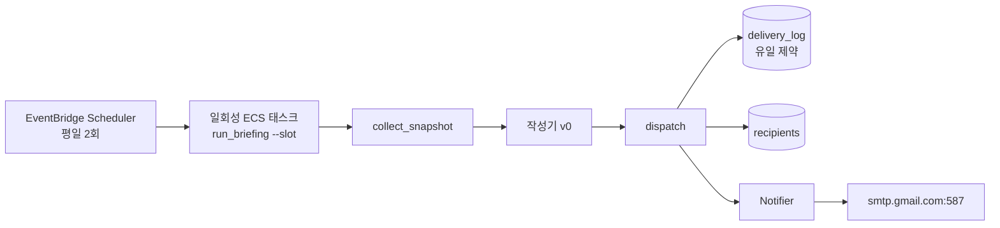

# 🗺️ 계획: 발송 채널 (메일 1차 발송)

> **개정 (2026-10-07)**: 발신 도메인이 없어 발송 수단을 Amazon SES 에서 **발송 전용 Gmail 계정 + 앱 비밀번호(SMTP)** 로 바꿨다.
> 근거는 분석의 개정 절과 [[2026-10-07_gmail-smtp-sending]]. Task 1·5·8 과 변경 대상 표가 달라졌고 나머지는 그대로다.

## 목표
평일 국내 개장 시각과 미국 개장 시각에 EventBridge Scheduler 가 발송 작업을 한 번 띄우고,
그 작업이 수집 결과로 만든 브리핑을 등록된 수신자에게 Gmail SMTP 로 보낸다.
같은 (날짜·슬롯·수신자·채널) 조합은 작업이 두 번 떠도 한 번만 발송된다.
채널은 `Notifier` 인터페이스 뒤에 있어 카카오톡·문자를 나중에 붙일 수 있다.

**이 계획의 범위 밖**
- **카카오톡 "나에게 보내기"**: 분석에서 2차 채널로 정했다. 토큰 유효기간·길이 제한을 리서치에서 확인하지 못했으므로 메일이 돌아간 뒤 별도 리서치·계획으로 다룬다.
- **LLM 요약**: 분석이 아직 없다. 이 계획은 수집 결과를 틀에 맞춰 나열하는 단순 작성기(v0)로 끝까지 연결하고, LLM 요약은 그 자리를 나중에 대체한다.
- **문자**: 분석에서 보류했다.

## 구조


## 설계 결정
- **실행 형태는 일회성 ECS 태스크**: 스케줄러가 서비스와 같은 이미지를 다른 명령으로 한 번 실행한다. ALB 뒤에 인증이 필요한 내부 엔드포인트를 열지 않아도 되고, 상시 도는 태스크 2개 중 누가 보낼지 정할 필요가 없다. Task 1 에서 이 형태가 현재 클러스터 구성(EC2 launch type, bridge 네트워크)에서 되는지 확인한다.
- **중복 방지는 DB 유일 제약**: 발송 전에 `delivery_log` 에 행을 넣어 선점한다. 이미 있으면 건너뛴다. 잠금이 아니라 제약이 방어선이다.
- **발송 시각 기본값**: 국내 슬롯은 Asia/Seoul 09:00, 미국 슬롯은 America/New_York 09:30, 월~금. 서머타임은 시간대 지정으로 따라간다. 정각인지 몇 분 전인지는 스케줄 식 하나라 나중에 바꾸기 쉽다.
- **DB 접근**: 앱에 DB 코드가 아직 없다. SQLAlchemy 2 + 마이그레이션 도구(Alembic)를 들인다. 접속 정보는 기존 관례(`APP_DB_HOST`, `APP_DB_PASSWORD` 를 `secrets` 로)에 맞춘다.
- **SMTP 는 표준 라이브러리**: `smtplib` + `email.message.EmailMessage`. 발송은 하루 2회 배치라 동기로 충분하고 의존성이 늘지 않는다. 연결은 실행당 한 번 열어 수신자 전원에게 쓰고 닫는다.
- **수신자마다 따로 보낸다**: 한 통에 여러 수신자를 넣지 않는다. 지인끼리 주소가 노출되지 않고, 발송 기록이 수신자 단위로 남는다.
- **앱 비밀번호는 비밀값**: `APP_SMTP_PASSWORD` 를 `SecretStr` 로 읽고, 운영에서는 SSM Parameter Store → `secrets` 로 주입한다. 로그·예외 메시지에 남기지 않는다.
- **인증 실패는 메일로 알릴 수 없다**: 앱 비밀번호가 폐기되면 알림 메일도 못 보낸다. 작업을 0 이 아닌 종료 코드와 오류 로그로 끝내고, 기존 알람 토픽으로 드러나게 한다.
- **기존 규칙 유지**: `/health` 는 DB·SMTP 를 보지 않는다. 스키마 변경은 새 테이블 추가뿐이라 하위 호환이다.

## 변경 대상
| 경로 | 신규/수정 | 역할 |
|---|---|---|
| `docs/01_research/2026-10-07_delivery-poc.md` | 신규 | PoC 결과 기록 (Task 1) |
| `pyproject.toml` | 수정 | sqlalchemy·DB 드라이버·alembic 추가와 버전 고정 |
| `src/finbrief_analyzer/core/config.py` | 수정 | DB 접속, SMTP 호스트·포트·계정·앱 비밀번호, 발신 표시 이름, 운영자 주소 필드 |
| `.env.example` | 수정 | 새 환경변수 예시 |
| `src/finbrief_analyzer/deliver/models.py` | 신규 | `Briefing`, `Channel`, `DeliveryStatus` |
| `src/finbrief_analyzer/deliver/ports.py` | 신규 | `Notifier` 프로토콜 |
| `src/finbrief_analyzer/deliver/render.py` | 신규 | `Briefing` → 메일 제목·본문(text, HTML) |
| `src/finbrief_analyzer/deliver/smtp.py` | 신규 | SMTP `Notifier` 구현 |
| `src/finbrief_analyzer/deliver/dispatch.py` | 신규 | 수신자 순회, 선점, 발송, 결과 기록 |
| `src/finbrief_analyzer/core/db.py` | 신규 | 엔진·세션 팩토리 |
| `src/finbrief_analyzer/store/tables.py` | 신규 | `recipients`, `delivery_log` 테이블 정의 |
| `src/finbrief_analyzer/store/recipients.py` | 신규 | 수신자 조회 |
| `src/finbrief_analyzer/store/delivery_log.py` | 신규 | 선점(`claim`)과 결과 갱신 |
| `migrations/` | 신규 | Alembic 환경과 첫 마이그레이션 |
| `src/finbrief_analyzer/compose/simple.py` | 신규 | `MarketSnapshot` → `Briefing` 단순 작성기 v0 |
| `src/finbrief_analyzer/jobs/run_briefing.py` | 신규 | 일회성 작업 엔트리포인트 (`--slot`) |
| `deploy/terraform/service/schedule.tf` | 신규 | 스케줄 2개, 스케줄러 실행 역할, 작업 실패 알람 |
| `deploy/terraform/service/variables.tf`, `terraform.tfvars.example` | 수정 | 스케줄 식 변수, `secrets` 예시에 `APP_SMTP_PASSWORD` |
| `deploy/README.md` | 수정 | 마이그레이션 실행 방법, 수신자 등록 방법, 앱 비밀번호 교체 절차 |
| `tests/deliver/`, `tests/store/`, `tests/jobs/` | 신규 | 모듈별 테스트 |

## Task 목록

### Task 1 — PoC: Gmail SMTP 와 스케줄러가 실제로 되는지 확인
- **목적**: 분석의 전제 중 리서치로 확인하지 못한 것을 코드 전에 확인한다.
- **선행**: 없음. **사용자 준비 필요**: 발송 전용 Gmail 계정 생성, 2단계 인증 설정, 앱 비밀번호 발급.
- **확인할 것**
  1. 로컬 PC 에서 `smtp.gmail.com:587` 로 로그인해 본인 주소로 한 통 보냈을 때 받은편지함에 도착하는가.
  2. 받은 메일의 `Authentication-Results` 에 spf=pass·dkim=pass 가 찍히는가.
  3. **AWS 호스트(NAT 의 고정 IP 경유)에서 같은 로그인이 되는가.** "새 위치"로 차단되면 어떤 오류가 오고, 어떻게 풀리는가. 풀리지 않으면 분석으로 돌아가 도메인 + SES 를 다시 본다.
  4. EventBridge Scheduler 가 `America/New_York` 시간대 지정과 ECS RunTask 대상을 지원하는가. EC2 launch type·bridge 네트워크인 현재 클러스터에서 일회성 태스크가 뜨는가.
  5. 마이그레이션을 어디서 실행할 것인가(배포 스크립트 안, 일회성 태스크, 수동). `deploy/ecs/deploy.sh` 와 CI 워크플로를 읽고 정한다.
  6. 운영 DB(별도 EC2)의 종류·버전과, CI 에서 테스트용 DB 를 띄울 수 있는지.
- **먼저 쓸 테스트**: 없음 (탐색).
- **DoD**: 위 6개 항목의 결과와 결정이 `docs/01_research/2026-10-07_delivery-poc.md` 에 적혀 있다. 앱 비밀번호 값은 문서에 없다.
- **검증**: 문서 리뷰. 실제 수신함에서 메일 확인.
- **예상 규모**: 문서 ~80줄. 소요 시간 모름 (3번은 AWS 환경 접근이 있어야 한다).

### Task 2 — 브리핑 모델, Notifier 인터페이스, 렌더러
- **목적**: 발송 쪽이 받을 입력의 모양을 고정한다. 작성기(v0, 이후 LLM)와 발송 사이의 계약이다.
- **선행**: Task 1
- **먼저 쓸 테스트**: `Briefing` 이 필수 섹션이 비었는지 스스로 판정한다 / 렌더러가 슬롯·날짜가 들어간 제목을 만든다 / 본문의 뉴스 항목마다 원문 링크가 들어간다 / HTML 본문이 외부에서 온 문자열(기사 제목 등)을 이스케이프한다 / text 본문과 HTML 본문이 같은 항목 수를 가진다.
- **DoD**: 빌드 통과 / 테스트 통과 / `deliver/models.py`·`ports.py` 에 외부 라이브러리 import 없음.
- **검증**: `uv run pytest tests/deliver/test_render.py` · `make check`
- **예상 규모**: ~250줄

### Task 3 — DB 기반 (엔진·세션·마이그레이션 환경)
- **목적**: 앱이 DB 를 쓸 수 있는 최소 기반을 만든다.
- **선행**: Task 1
- **먼저 쓸 테스트**: `Settings` 가 `APP_DB_*` 로 접속 URL 을 조립하고 비밀번호가 `repr` 에 노출되지 않는다 / 세션 팩토리가 트랜잭션을 커밋하고 예외 시 롤백한다 / DB 설정이 없어도 `create_app()` 과 `/health` 는 동작한다.
- **DoD**: 빌드 통과 / 테스트 통과 / 빈 마이그레이션 환경이 로컬 postgres(`make up`)에 적용됨 / `/health` 가 DB 를 건드리지 않음 / 의존성 버전 고정.
- **검증**: `make up` · `uv run alembic upgrade head` · `make check`
- **예상 규모**: ~250줄 (Alembic 생성 파일 포함)

### Task 4 — 수신자·발송 기록 스키마와 저장소
- **목적**: 누구에게 보낼지와 이미 보냈는지를 컨테이너 밖에 둔다.
- **선행**: Task 3
- **먼저 쓸 테스트**: 활성 수신자만 조회된다 / 같은 (날짜·슬롯·수신자·채널)에 대한 두 번째 `claim` 은 `False` 를 돌려준다 / 서로 다른 슬롯은 각각 선점된다 / 선점 후 실패로 기록된 건은 재시도 시 다시 선점할 수 있다 / 발송 결과(성공·실패·사유)가 갱신된다.
- **DoD**: 빌드 통과 / 테스트 통과 / 유일 제약이 마이그레이션에 있음 / 마이그레이션이 테이블 추가만 함(하위 호환) / 내려가는 마이그레이션(downgrade)이 동작함.
- **검증**: `uv run pytest tests/store` · `uv run alembic upgrade head && uv run alembic downgrade -1` · `make check`
- **예상 규모**: ~300줄

### Task 5 — SMTP Notifier
- **목적**: `Notifier` 의 첫 구현.
- **선행**: Task 2
- **먼저 쓸 테스트**: 렌더된 제목·text·HTML 이 multipart 메시지에 그대로 들어간다 / From 은 설정의 계정과 표시 이름, To 는 수신자 한 명이다 / 연결 직후 STARTTLS 를 건 뒤에 로그인한다 / 인증 실패는 "재시도 불가" 도메인 예외로 바꾼다 / 일시적 오류(4xx 응답, 연결 끊김)는 "재시도 가능"으로 구분된다 / 수신자 거절은 그 수신자만의 실패로 보고된다 / 앱 비밀번호가 예외 메시지에 남지 않는다.
- **DoD**: 빌드 통과 / 테스트 통과 / 테스트가 실제 SMTP 서버에 접속하지 않음(가짜 연결 주입) / 새 런타임 의존성 없음.
- **검증**: `uv run pytest tests/deliver/test_smtp.py` · `make check`
- **예상 규모**: ~200줄

### Task 6 — 발송 조율 (dispatch)
- **목적**: 수신자별 선점 → 발송 → 기록의 흐름과 실패 처리를 한곳에 둔다.
- **선행**: Task 4, Task 5
- **먼저 쓸 테스트**: 선점에 성공한 수신자에게만 보낸다 / 이미 선점된 수신자는 건너뛴다 / 한 수신자 발송이 실패해도 나머지에게는 보낸다 / 실패는 사유와 함께 기록된다 / 인증 실패가 나면 남은 수신자를 시도하지 않고 전체 실패로 끝낸다 / 필수 섹션이 빈 브리핑은 아무에게도 보내지 않고 운영자에게만 실패 알림을 보낸다 / 결과 요약(성공·건너뜀·실패 수)을 돌려준다.
- **DoD**: 빌드 통과 / 테스트 통과 / 가짜 `Notifier` 와 테스트 DB 로만 검증 / 같은 입력으로 두 번 실행해도 발송 수가 늘지 않음.
- **검증**: `uv run pytest tests/deliver/test_dispatch.py` · `make check`
- **예상 규모**: ~250줄

### Task 7 — 단순 작성기 v0 와 작업 엔트리포인트
- **목적**: 수집 → 작성 → 발송을 한 명령으로 잇는다. 이 Task 가 끝나면 로컬에서 실제 메일이 나간다.
- **선행**: Task 6. **다른 계획의 선행**: [[2026-10-07_data-sources]] 의 Task 10 (`collect_snapshot`).
- **먼저 쓸 테스트**: 작성기가 스냅샷의 지수·환율·금리를 등락률과 함께 섹션으로 만든다 / 누락·휴장으로 표시된 항목은 그 사실을 본문에 적는다 / 뉴스는 제목과 링크만 나열한다 / `--slot` 이 잘못되면 0 이 아닌 종료 코드로 끝난다 / 수집·작성·발송을 가짜로 바꿔 끼운 작업이 종료 코드 0 과 결과 요약 로그를 낸다 / 발송 대상 시장이 휴장이면 보내지 않고 정상 종료한다 / 발송이 전체 실패하면 0 이 아닌 종료 코드로 끝난다.
- **DoD**: 빌드 통과 / 테스트 통과 / `uv run python -m finbrief_analyzer.jobs.run_briefing --slot kr_open` 이 로컬에서 동작 / Docker 이미지에서 같은 명령이 실행됨 / 로그에 수신자 주소 전체나 비밀값이 남지 않음.
- **검증**: `uv run pytest tests/jobs` · `make check` · `make docker`
- **예상 규모**: ~300줄

### Task 8 — 인프라: 비밀값, 스케줄, 실패 알람
- **목적**: 운영 환경에서 정해진 시각에 작업이 뜨고, 실패하면 드러나게 한다.
- **선행**: Task 7, Task 1 의 결정
- **먼저 쓸 테스트**: 없음 (terraform). 대신 `terraform validate` 와 plan 출력 검토.
- **DoD**: `make tf-plan` 이 스케줄 2개·스케줄러 역할·알람·`secrets` 항목의 추가만 보여 주고 기존 리소스의 교체가 없음 / 앱 비밀번호가 tfvars·코드·git 에 평문으로 없음(SSM ARN 만) / 스케줄 식과 시간대가 변수로 빠져 있음 / 작업 실패가 기존 알람 토픽으로 전달됨 / `deploy/README.md` 에 마이그레이션 실행·수신자 등록·앱 비밀번호 교체 절차가 있음.
- **검증**: `make tf-plan` · 적용 후 스케줄을 수동 실행해 메일 1통 수신 확인 · `make ecs-status`
- **예상 규모**: ~180줄
- **주의**: `terraform apply`, SSM 비밀값 등록, 운영 DB 마이그레이션은 사용자 확인을 받고 진행한다. main 에 들어가면 배포된다.

## 의존 그래프
```
Task 1 ─┬→ Task 2 → Task 5 ─┐
        └→ Task 3 → Task 4 ─┴→ Task 6 → Task 7 → Task 8
                                          ↑
                    data-sources Task 10 ─┘
```
Task 2·5 와 Task 3·4 는 서로 독립이라 병행할 수 있다.

## PoC 로 먼저 확인할 것 (가장 앞 Task 로)
- [ ] 로컬에서 앱 비밀번호로 발송되고 SPF·DKIM 이 통과하는가 (Task 1-1, 1-2). 통과 여부의 공식 명시 문구는 리서치에서 찾지 못했다
- [ ] AWS 호스트에서의 로그인이 차단되지 않는가 (Task 1-3). 이 계획의 가장 큰 불확실성이다
- [ ] EventBridge Scheduler 의 시간대 지정과 ECS RunTask 대상 (Task 1-4). 리서치 범위 밖이었다
- [ ] 마이그레이션 실행 위치 (Task 1-5)
- [ ] 운영 DB 종류·버전, CI 테스트 DB (Task 1-6)

## 사용자 확인이 필요한 것
- **발송 전용 Gmail 계정 준비.** 계정 생성 → 2단계 인증 → 앱 비밀번호 발급. 앱 비밀번호는 `.env` 의 `APP_SMTP_PASSWORD` 에만 넣는다.
- **발송 시각.** 기본값은 개장 정각(09:00 KST, 09:30 ET)이다. 개장 전에 받고 싶으면 스케줄 식만 바꾸면 된다.
- **수신자 등록 방식.** 이 계획은 가입 화면을 만들지 않는다. 수신자는 운영자가 DB 에 직접 넣는다.
- **AWS 접근.** 이 PC 에 `aws`·`terraform` CLI 가 없다. Task 1-3·1-4 와 Task 8 은 AWS 에 접근할 수 있는 환경이 필요하다.

## 롤백
- 스케줄 2개를 비활성화하면 발송이 즉시 멈춘다. 코드 배포 없이 된다.
- 앱 비밀번호를 Google 계정에서 폐기하면 그 비밀값으로는 더 보낼 수 없다.
- 인프라는 Task 8 의 terraform 변경을 되돌리면 된다. 스케줄에는 고정비가 없다.
- 스키마는 새 테이블 2개뿐이라 남겨 둬도 기존 코드에 영향이 없다. 지우려면 downgrade 를 실행한다.
- 코드는 Task 단위 커밋이라 `git revert` 로 되돌린다. `/health` 와 기존 서비스 경로는 이 계획에서 바뀌지 않는다.
- Task 1-3 에서 AWS 로그인이 풀리지 않으면 도메인 + SES 로 돌아간다. `Notifier` 구현(Task 5)과 Task 8 만 바뀌고 나머지 Task 는 그대로 쓴다.
- Task 1-4 에서 일회성 태스크 방식이 안 되면 분석의 대안(앱 내부 스케줄러 + 잠금)을 다시 검토한다.

## 관련
- 분석: [[2026-10-07_delivery-channels]]
- 리서치(개정 근거): [[2026-10-07_gmail-smtp-sending]]
- 짝 계획: [[2026-10-07_data-sources]]
