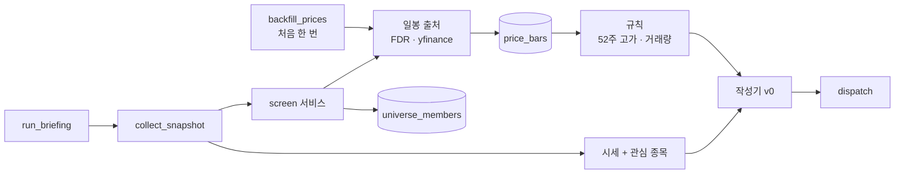

# 🗺️ 계획: 개별 종목 스크리닝 1차 (관심 종목 + 단기 규칙)

## 목표
브리핑 메일에 두 가지가 더 실린다.
① 국내·미국 **관심 종목** 각 10개의 종가와 등락.
② 대형주 종목군(국내 시가총액 상위 KOSPI 200 + KOSDAQ 150, 미국 S&P 500)에서 뽑은 **단기 조건 충족 종목** — "52주 신고가 근접"과 "거래량 급증" 규칙별 상위 5개씩.
일봉은 DB 에 쌓이고, 스크리닝은 마감이 끝난 날의 값만 쓴다. 스크리닝이 실패해도 브리핑은 그대로 나간다.
메일은 이 목록을 "추천"이라고 부르지 않고, 규칙·기준일·고지 문구를 같이 싣는다.

**이 계획의 범위 밖** (분석의 3·4단계 — 이 계획이 끝난 뒤 별도 계획으로)
- **장기 조건 충족 종목**: DART 재무 어댑터, 종목코드 → 기업코드 매핑, 합산 순위. 12-1 모멘텀은 이 계획이 쌓는 이력을 그대로 쓴다.
- **미국 재무 (SEC EDGAR)**: `frames` 가 S&P 500 을 얼마나 덮는지부터 확인해야 한다.
- **백테스트**: 이력이 쌓인 뒤.
- **정해진 시각의 자동 실행**: delivery-channels Task 8 이 보류 중이다. 이 계획은 수동 실행 명령까지만 만든다.

Task 가 10개를 넘지 않게 하려고 장기 규칙을 떼어 냈다. 분석의 결정은 그대로다.

## 구조


## 설계 결정
- **새 패키지 `screen/`**: 종목군·일봉 출처·규칙·조립을 `collect/` 와 나눈다. `collect/` 는 "오늘 값 하나", `screen/` 은 "이력과 순위"다.
- **규칙은 순수 함수다.** 입력은 일봉 목록, 출력은 점수. DB·네트워크를 모른다. 백테스트가 같은 함수를 쓴다.
- **스크리닝은 수집의 한 출처로 붙는다.** `Providers.screens` 가 없으면(설정 꺼짐, DB 없음) 건너뛴다. 실패하면 `missing` 에 `"screen"` 이 올라간다.
- **관심 종목은 기존 시세 경로를 쓴다.** DB 이력과 무관하다. `QuoteSymbol` 에 종목을 넣고 `Market` 에 묶음 두 개를 더한다.
- **이력의 처음 받기는 별도 명령이다.** 850종목 × 1년치를 발송 작업 안에서 받지 않는다. 발송 작업은 최근 며칠만 덧붙인다.
- **마감이 끝난 날만 쓴다.** `collect.service.expected_session` 이 이미 있다. 그 날짜 이후의 행은 저장하지 않는다.
- **겹쳐 받아 어긋남을 본다.** 매일 받는 최근 며칠이 저장된 값과 다르면 그 종목의 이력을 지우고 다시 받는다.
- **고지 문구는 `Briefing` 의 새 필드(각주)다.** 안내(`notices`)는 본문 위, 각주는 본문 아래.
- **스키마는 테이블 추가만 한다.** 기존 테이블을 바꾸지 않는다.

## 변경 대상
| 경로 | 신규/수정 | 역할 |
|---|---|---|
| `docs/01_research/2026-10-08_screening-poc.md` | 신규 | PoC 결과 (Task 1) |
| `src/finbrief_analyzer/collect/models.py` | 수정 | `Market.KR_STOCK`·`US_STOCK`, `MarketSnapshot.screens` |
| `src/finbrief_analyzer/core/config.py` | 수정 | `watchlist` 기본값, 스크리닝 설정(켜기, 종목군 크기, 최소 거래대금, 묶음 크기·간격, 상위 개수) |
| `.env.example` | 수정 | 새 변수 예시 |
| `src/finbrief_analyzer/collect/service.py` | 수정 | 관심 종목을 시세에 합침, `Providers.screens` 호출 |
| `src/finbrief_analyzer/collect/quotes_yf.py` | 수정 | 매핑에 없는 미국 티커를 그대로 통과 |
| `src/finbrief_analyzer/screen/models.py` | 신규 | `Bar`, `Member`, `ScreenHit`, `ScreenResult` |
| `src/finbrief_analyzer/screen/universe.py` | 신규 | 목록 → 종목군 (시가총액 순위, 제외 규칙) |
| `src/finbrief_analyzer/screen/sources.py` | 신규 | 국내 전 종목 하루치, 종목별 이력, 미국 묶음 조회 |
| `src/finbrief_analyzer/screen/history.py` | 신규 | 처음 받기, 매일 덧붙이기, 어긋남 감지 |
| `src/finbrief_analyzer/screen/rules.py` | 신규 | 52주 고가 비율, 거래량 비율, 순위 |
| `src/finbrief_analyzer/screen/service.py` | 신규 | 갱신 → 규칙 → `ScreenResult` |
| `src/finbrief_analyzer/store/tables.py` | 수정 | `price_bars`, `universe_members` |
| `src/finbrief_analyzer/store/price_bars.py`, `store/universe.py` | 신규 | 넣기(중복 무시), 이력 읽기, 종목군 읽기·교체 |
| `src/finbrief_analyzer/migrations/versions/0002_price_bars_universe.py` | 신규 | 테이블 2개 추가 |
| `src/finbrief_analyzer/jobs/backfill_prices.py` | 신규 | 처음 받기 명령 |
| `src/finbrief_analyzer/jobs/run_briefing.py` | 수정 | 스크리닝 의존성 배선 |
| `src/finbrief_analyzer/deliver/models.py`, `deliver/render.py` | 수정 | `Briefing.footnotes` 와 렌더링 |
| `src/finbrief_analyzer/compose/simple.py` | 수정 | 관심 종목 묶음, 조건 충족 종목 섹션, 고지 문구 |
| `tests/screen/`, `tests/store/`, `tests/compose/`, `tests/jobs/` | 신규/수정 | 모듈별 테스트 |

## Task 목록

### Task 1 — PoC: 대량 일봉 조회, 종목군 걸러 내기, 어긋남 감지
- **목적**: 분석의 전제 중 실측하지 않은 것을 코드 전에 확인한다. 틀리면 종목군 크기와 받는 방식이 바뀐다.
- **선행**: 없음
- **확인할 것**
  1. FDR 로 국내 350종목의 1년 일봉을 종목별로 받는 데 걸리는 시간, 실패·차단 여부.
  2. `yf.download` 로 미국 500종목의 1년 일봉을 받을 때 묶음 크기(50·100·250)별 시간과 차단 여부. 차단되면 풀리는 데 걸리는 시간.
  3. 매일 덧붙이기: 미국 500종목의 최근 5일을 묶어 받는 시간. 국내 전 종목 하루치의 날짜가 무엇을 가리키는지(장중·장 마감 뒤·개장 전).
  4. `StockListing('KRX')` 에서 우선주·ETF·ETN·스팩·리츠를 걸러 내는 기준 (이름 규칙, `Dept`, 종목코드 끝자리).
  5. 최근 분할한 종목 하나로 "겹친 날의 종가가 달라지는가"를 확인. 국내 FDR 이력이 수정주가인지.
  6. 최소 거래대금 기준값 — 종목군 안에서의 분포를 보고 정한다.
  7. 관심 종목 기본값: 국내 시가총액 상위 10, 미국 시가총액 상위 10 (미국 목록에는 시가총액이 없으므로 출처를 정한다).
- **먼저 쓸 테스트**: 없음 (탐색).
- **DoD**: 7개 항목의 결과와 결정이 문서에 있다. 일회성 스크립트는 커밋하지 않는다.
- **검증**: 문서 리뷰
- **예상 규모**: 문서 ~100줄. 2번에서 차단되면 풀릴 때까지 기다려야 해서 소요 시간은 모름.

### Task 2 — 관심 종목 시세
- **목적**: 가장 작은 조각을 먼저 메일에 싣는다. DB 이력과 무관하다.
- **선행**: Task 1 (기본 목록)
- **먼저 쓸 테스트**: 관심 종목 기본값은 국내 10개·미국 10개이고 겹치지 않는다 / 관심 종목이 지수와 함께 한 번의 요청 목록에 들어간다 / 관심 종목을 못 가져오면 `missing` 에 올라가고 나머지는 그대로다 / 작성기가 "국내 관심 종목"·"미국 관심 종목" 묶음을 만든다 / 관심 종목 묶음은 지수 묶음 뒤에 온다 / 관심 종목이 휴장 판정에 끼어들지 않는다 / 매핑에 없는 미국 티커는 yfinance 예비에 그대로 넘어간다 / 관심 종목을 빈 목록으로 설정하면 묶음이 없다.
- **DoD**: 빌드 통과 / 테스트 통과 / 실제 실행에서 20종목의 값이 온다.
- **검증**: `uv run pytest tests/collect tests/compose tests/test_config.py` · `make check` 상당
- **예상 규모**: ~250줄

### Task 3 — 일봉·종목군 스키마와 저장소
- **목적**: 이력을 쌓을 자리를 만든다. 아직 아무도 부르지 않는다.
- **선행**: Task 1 (수정주가 여부에 따라 열이 달라질 수 있다)
- **먼저 쓸 테스트**: 같은 (종목, 날짜)를 두 번 넣어도 한 행이다 / 이력은 날짜 오름차순으로 온다 / 종목별 마지막 날짜를 한 번에 읽는다 / 한 종목의 이력을 지울 수 있다 / 종목군 교체는 이전 구성을 남기지 않는다 / 마이그레이션을 내렸다 올려도 스키마가 같다 / 마이그레이션 결과의 열이 테이블 정의와 같다.
- **DoD**: 빌드 통과 / 테스트 통과 / 마이그레이션이 테이블 추가만 한다 / 로컬 postgres 에서 올리고 내려 본다.
- **검증**: `uv run pytest tests/store` · `uv run alembic upgrade head && uv run alembic downgrade -1`
- **예상 규모**: ~300줄

### Task 4 — 종목군 구성
- **목적**: 목록에서 "대형주 350 + S&P 500"을 만든다.
- **선행**: Task 1 (제외 기준), Task 3
- **먼저 쓸 테스트**: 시가총액 상위 N 개를 시장별로 자른다 / 우선주·ETF·스팩은 순위에 들어가지 않는다 / 목록이 비어 오면 기존 종목군을 지우지 않는다 / 같은 달에는 다시 계산하지 않는다 / 달이 바뀌면 다시 계산한다 / 미국은 목록의 종목을 그대로 쓴다.
- **DoD**: 빌드 통과 / 테스트 통과 / 목록 출처가 실패해도 예외가 밖으로 나가지 않는다.
- **검증**: `uv run pytest tests/screen/test_universe.py`
- **예상 규모**: ~250줄

### Task 5 — 일봉 출처 어댑터
- **목적**: 세 가지 조회(국내 전 종목 하루치, 종목별 이력, 미국 묶음)를 `Bar` 로 바꾼다.
- **선행**: Task 1 (묶음 크기·간격), Task 3 (`Bar`)
- **먼저 쓸 테스트**: 표의 행이 `Bar`(시·고·저·종·거래량)로 바뀐다 / 종가가 NaN 인 행은 버린다 / 묶음 조회가 설정된 크기로 나뉜다 / 묶음 사이에 설정된 간격을 둔다 / 한 묶음이 실패해도 나머지 묶음의 결과를 돌려준다 / 실패한 종목 이름을 돌려준다 / pandas 값이 어댑터 밖으로 나가지 않는다.
- **DoD**: 빌드 통과 / 테스트 통과(네트워크 없음, fetch 주입) / 타입에 `Any` 가 새지 않는다.
- **검증**: `uv run pytest tests/screen/test_sources.py`
- **예상 규모**: ~300줄

### Task 6 — 이력 갱신과 처음 받기 명령
- **목적**: 이력이 실제로 쌓이게 한다.
- **선행**: Task 3, Task 4, Task 5
- **먼저 쓸 테스트**: 이력이 없는 종목만 처음 받기 대상이다 / 처음 받기를 다시 실행하면 이미 받은 종목은 건너뛴다 / 매일 갱신은 마감이 끝나지 않은 날의 행을 저장하지 않는다 / 겹친 날의 종가가 저장된 값과 다르면 그 종목을 지우고 다시 받는다 / 출처가 실패한 종목은 다음 실행에서 다시 대상이 된다 / 시간 상한을 넘으면 남은 종목을 건너뛰고 끝낸다 / 명령의 종료 코드는 받은 수·실패 수를 로그에 남기고 0 이다.
- **DoD**: 빌드 통과 / 테스트 통과 / 로컬 DB 에 850종목의 1년치가 실제로 들어간다.
- **검증**: `uv run pytest tests/screen/test_history.py tests/jobs` · 수동: `uv run python -m finbrief_analyzer.jobs.backfill_prices`
- **예상 규모**: ~350줄

### Task 7 — 규칙
- **목적**: 일봉 목록에서 점수와 순위를 낸다. 순수 함수.
- **선행**: Task 3 (`Bar`). Task 4~6 과 독립.
- **먼저 쓸 테스트**: 52주 고가 비율은 마지막 종가 ÷ 최근 252거래일 최고 종가다 / 오늘이 최고가면 비율이 1 이다 / 이력이 기준 일수보다 짧은 종목은 순위에서 빠진다 / 거래량 비율은 당일 ÷ 직전 20일 평균이고 당일은 평균에 넣지 않는다 / 평균 거래량이 0 이면 빠진다 / 최소 거래대금 미만은 빠진다 / 상위 N 개를 점수 내림차순으로 돌려준다 / 동점은 종목코드 순으로 결과가 항상 같다.
- **DoD**: 빌드 통과 / 테스트 통과 / 이 모듈에 pandas·DB·네트워크 import 없음.
- **검증**: `uv run pytest tests/screen/test_rules.py`
- **예상 규모**: ~200줄

### Task 8 — 수집·작성에 연결하고 메일에 싣기
- **목적**: 끝에서 끝까지 잇는다.
- **선행**: Task 2, Task 6, Task 7
- **먼저 쓸 테스트**: 스크리닝 결과가 스냅샷에 실린다 / 스크리닝이 실패하면 `missing` 에 올라가고 브리핑은 발송 가능하다 / 스크리닝이 꺼져 있으면 섹션이 없다 / 섹션 제목에 "추천"이 없다 / 각 섹션에 규칙 설명과 기준일이 있다 / 조건 충족 섹션이 하나라도 있으면 고지 문구가 본문 맨 아래에 있다 / 섹션이 없으면 고지 문구도 없다 / 각주는 text 와 HTML 양쪽에 있다 / 스크리닝 섹션만 있고 시세가 없으면 발송 불가다.
- **DoD**: 빌드 통과 / 테스트 통과 / 실제 실행에서 메일 1통에 관심 종목과 조건 충족 종목이 실린다.
- **검증**: `uv run pytest tests/compose tests/collect tests/jobs tests/deliver` · 수동: `uv run python -m finbrief_analyzer.jobs.run_briefing --slot <아직 안 보낸 슬롯>`
- **예상 규모**: ~350줄

## 의존 그래프
```
Task 1 ─┬→ Task 2 ───────────────────────────┐
        ├→ Task 3 ─┬→ Task 4 ─┐              │
        │          ├→ Task 5 ─┴→ Task 6 ─┐   │
        │          └→ Task 7 ────────────┴───┴→ Task 8
```
Task 2 는 Task 3~7 과 독립이다. Task 7 은 Task 4~6 과 독립이다.

## PoC 로 먼저 확인할 것 (가장 앞 Task 로)
- [ ] Yahoo 가 500종목 × 1년치를 막지 않는가, 묶음 크기는 얼마가 안전한가 (Task 1-2). 이 계획의 가장 큰 불확실성이다
- [ ] 국내 350종목을 종목별로 받는 시간 (Task 1-1)
- [ ] 국내 전 종목 하루치의 날짜가 실행 시각에 따라 무엇인가 (Task 1-3)
- [ ] 우선주·ETF·스팩을 걸러 내는 기준 (Task 1-4)
- [ ] 수정주가 여부와 어긋남 감지가 분할을 잡는가 (Task 1-5)
- [ ] 최소 거래대금 기준값 (Task 1-6)
- [ ] 관심 종목 기본 20개 (Task 1-7)

## 사용자 확인이 필요한 것
- **처음 받기는 시간이 걸린다.** 850종목의 1년치다. Yahoo 가 막으면 며칠에 나눠 받아야 할 수 있다. PoC 에서 드러난다.
- **PC 와 DB 가 꺼져 있던 날은 이력이 빈다.** 다음 실행이 메우지만, 국내 전 종목 하루치는 지난 날짜를 주지 않아 종목별 조회로 메운다.
- **관심 종목 20개.** PoC 가 뽑은 시가총액 상위 목록을 보여 드리고, 바꾸고 싶은 종목이 있으면 그때 반영한다.
- **고지 문구의 정확한 문장.** Task 8 에서 초안을 보여 드린다.

## 롤백
- 스크리닝은 설정 하나(`APP_SCREEN_ENABLED=false`)로 끈다. 꺼지면 수집·작성·발송이 이 계획 이전과 같다.
- 관심 종목은 `APP_WATCHLIST=[]` 로 비운다.
- 테이블 2개는 추가뿐이다. 쓰지 않게 되면 그대로 두거나 `alembic downgrade` 로 내린다.
- Task 1 에서 Yahoo 대량 조회가 불가능하다고 나오면: 미국을 빼고 국내만으로 Task 3~8 을 진행한다. 바뀌는 것은 종목군 설정과 Task 5 의 미국 묶음 조회뿐이다.

## 관련
- 분석: [[2026-10-08_stock-screening]]
- 리서치: [[2026-10-08_stock-screening]]
- 앞선 계획: [[2026-10-07_delivery-channels]] (작성기·발송·DB 기반)
